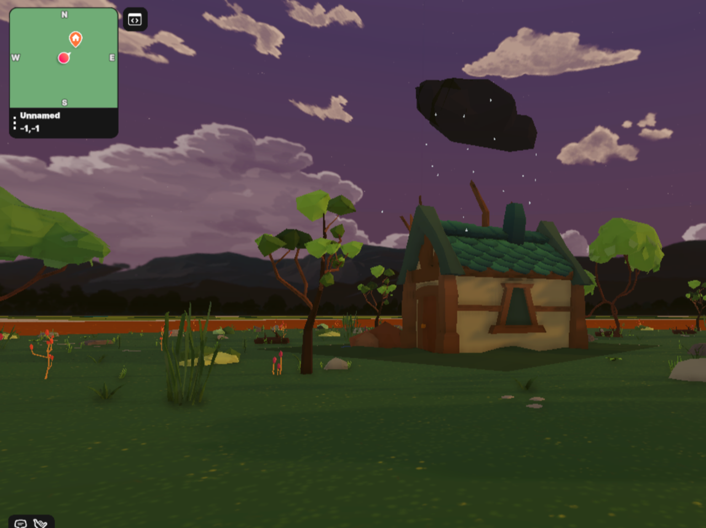

# ESP32 Decentraland Weather Toggle 

This repository contains code for an ESP32 device that utilizes a rain sensor, brightness sensor, and DHT11 sensor to toggle the weather state of an object in a local decentraland instance. The ESP32 sends the sensor data via MQTT to an external server running Node-RED. Node-RED calculates the weather state based on the sensor values and provides the solution in the form of a JSON response via an HTTP GET request. The decentraland instance then makes an HTTP GET request to retrieve the weather state and toggles a cloud object accordingly.

You can find the decentraland implementation here: [Decentraland Weather Simulation Repo](https://github.com/decentraland-scenes/Weather-simulation)

## Setup and Usage

1. Connect the ESP32 to the rain sensor, brightness sensor, and DHT11 sensor according to the pin configurations mentioned in the code.

2. Flash the ESP32 with the provided code using the Arduino IDE or any other suitable programming tool.

3. Configure the MQTT server settings in the code to match your setup.

4. Set up and configure Node-RED on a server to receive the MQTT messages and calculate the weather state.

5. Deploy the Node-RED flow provided in this repository. Adjust it as necessary based on your specific sensor calculations and desired response format.

6. Ensure that the decentraland instance has access to the Node-RED server and is able to make HTTP GET requests.

7. Modify the decentraland instance code to make an HTTP GET request to the Node-RED server and retrieve the weather state.

## Repository Contents

- `ESP32_MQTT.ino`: Arduino code for the ESP32 device, responsible for reading sensor data and sending it via MQTT.

- `flow.json`: Node-RED flow configuration, defining the MQTT message handling and weather state calculation.

## License

This project is licensed under the [MIT License](LICENSE).

Feel free to fork this repository and adapt the code to fit your specific use case.
